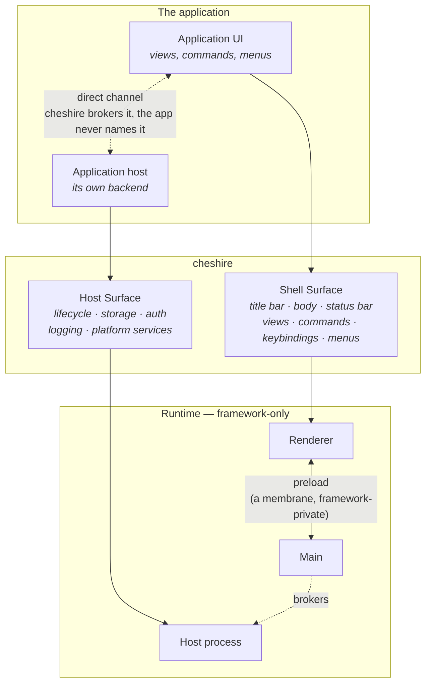

# The application surface — how an application layers on cheshire

> **Status:** Design intent, written 2026-08-05. Covers the whole surface an application will
> eventually meet, most of which is not built. **Marked throughout:** ✅ built · ◐ in progress ·
> ○ planned.
>
> This document settles the **layering** — the two surfaces, and which side of the line each
> concern falls on. It does **not** settle the API shape of anything unbuilt; that is decided at
> the stage that builds it, against a running thing (principle 6). Where a genuinely hard-to-reverse
> choice is visible from here, it is listed in §7 as a decision point rather than quietly assumed.
>
> Upstream of this document: [principles](principles.md), then
> [design & roadmap](design-and-roadmap.md). A conflict resolves in their favour.

---

## 1. The layering

```
┌──────────────────────────────────────────────────────────┐
│  The application            e.g. a clinical practice      │
│                             management layer              │
├──────────────────────────────────────────────────────────┤
│  cheshire                      shell, commands, design,      │
│                             services, build, packaging    │
├──────────────────────────────────────────────────────────┤
│  Electron                   runtime, replaceable (phase 4)│
└──────────────────────────────────────────────────────────┘
```

The application depends on released `@cheshire/*` packages and never on framework source
(principle 5). cheshire supplies every layer below the domain, including
the ones the application would otherwise have to assemble: the process model, the build, the
shell, and the services.

**Every import in this document is from `@cheshire/app`, and that is a rule rather than a
coincidence.** It is the application's whole surface onto cheshire — declarations on the barrel,
hooks on `/react`, components on `/ui`, the host entry on `/host` — and an application imports
that name and no other `@cheshire/*` package, ever. `@cheshire/core`, `@cheshire/react`,
`@cheshire/ui` and the rest are real packages with the responsibilities design & roadmap §7 gives
them, but they are the framework's internal factoring, not the application's vocabulary. Sample
code here that names one of them directly is a defect in this document, not an alternative
spelling.

The subpaths are entries of one package, the way `next/link` is, and not siblings an application
assembles — cheshire is a framework rather than a library, so it presents one surface instead of
a set to shop through.

### An application declares into a system; it never implements one

cheshire's capabilities come as **systems** — coherent, whole, already built (design & roadmap §2).
The application's job at every one of them is to *declare*, and the system's job is to do:

| System | Services | The application declares | cheshire does — with no application code |
| --- | --- | --- | --- |
| **design system** | components · icons · tokens · modes | which tokens, which mode default, which components it composes | the components, the icons, the token contract, light/dark, the switcher |
| **command system** | commands · shortcuts · menus · palette | that a command exists, its title, its default shortcut, where it appears | the registry, chord matching, the menu bar, context menus, the palette, the shortcuts editor |
| **shell system** | layout · notifications · dialogs · status bar | that a view exists and where it may live | the three zones, the regions, docking, resizing, restore-on-launch, the overlay plane |
| **customization system** | settings · keybinding overrides · theme selection | a settings schema | the editor UI, one persistence layer, change events, and the precedence rule |
| **storage system** | db · blob | a schema and migrations | the store, transactions, blobs, encryption |
| **identity system** | auth · credentials | which provider | sign-in, sessions, the OS keychain |
| **devtools system** | diagnostics · developer tooling | nothing | logging, crash capture, the viewer — plus dev-only tooling that never reaches a packaged build |

Read the right-hand column as the list of things an application would otherwise be writing. That
it is not writing them is the whole promise (principle 1), and it is why a contribution is a
**value** rather than a call: values can be validated, rendered, indexed into a palette, and
persisted against — a call can only be made.

**A system is reached through its services, and a service through one typed hook.**

```tsx
import { useCommands, useSettings } from '@cheshire/app/react'

function Toolbar() {
  const commands = useCommands()
  const settings = useSettings()
  return <button onClick={() => commands.execute('demo.save')} />
}
```

No service ids, no registry, no provider to learn. Both prior attempts used a service locator
(`useService(CommandServiceId)`) across ~30 services; cheshire has an order of magnitude fewer, so
the indirection would cost every reader a hop and buy nothing. Host-side services arrive the
same way in spirit — as a context object handed to the host entry, not as an import.

**One system cuts across the others, on purpose.** The customization system does not own the
command system's keybindings or the design system's tokens; it owns *the user's overrides to
them*, their shared persistence, and the editor UI. Every system keeps its own defaults and
stays understandable alone. The precedence is uniform: **user > application default > platform
default.**

### The application is a customer, not a plugin

This is the single most consequential thing about the layering, and principle 3 states it: **there
is no third-party plugin system.** An application contributing views, commands and menus is the
platform's ordinary surface.

The distinction is not cosmetic. It removes an entire category of machinery:

| A plugin platform needs | cheshire needs |
| --- | --- |
| A manifest file, parsed and validated at runtime | Typed values in `src/index.ts`, checked at build |
| A sandbox per extension — iframes, a `view://` scheme, per-view CSP tiers | One renderer, one policy |
| Trust classes, permission scopes, capability allowlists | First-party code throughout |
| An API version handshake between host and extension | One version, one lockfile, one build |
| Lazy activation events (`onCommand`, `onView`) | An import graph the bundler already understands |

The prior attempt (`new-ru-soam`) carries all of it, because its bundles are separately loaded
artifacts. cheshire keeps its **contribution vocabulary** — activity bar items, view containers,
views with a location, panels, status bar items, menus that reference command ids — and drops the
delivery mechanism entirely. Same words, no manifest.

The practical payoff: **a contribution is a value the compiler can see.** A typo'd command id in a
menu is a build error naming the application's own file, not a runtime warning in a log.

---

## 2. Two surfaces

An application meets cheshire at exactly two places. Everything else is cheshire's.



**The Shell Surface** is what the application contributes to the UI, and it runs in the
renderer. §3.

**The Host Surface** is the application's own backend process, and the platform services it calls.
§4. It exists because an application's backend is not the framework's main process — main is
privileged, framework-owned, and holds the window and the OS; putting domain code there makes the
framework's most trusted process exactly as trustworthy as the application in it.

**Neither surface names the runtime** (principle 4). No Electron module, no IPC channel, no protocol
scheme, no `window.cheshire`. The preload bridge is a *membrane* — a place messages pass through,
never a place logic lives — and it is framework-private in both directions.

---

## 3. The Shell Surface

Everything here is declared from `src/index.ts` by default-exporting `defineApp({ ... })`. The
application splits its own files however it likes; `src/index.ts` is the assembly point.

```ts
// src/index.ts — the whole file, however large the application gets
import { defineApp } from '@cheshire/app'
import { views } from './views'
import { commands } from './commands'
import { menus } from './menus'

export default defineApp({ views, commands, menus })
```

### 3.1 What can be contributed

| Contribution | What it is | Status |
| --- | --- | --- |
| **view** | `{ id, title, component }` — a React component the shell renders | ✅ stage 1 |
| **command** | `{ id, title, shortcut?, run }` — a named action, id namespaced `ns.verb` | ◐ stage 2b |
| **menu** | `{ label, items }` where an item **references a command id** — a menu never holds a handler | ◐ stage 2b |
| **keybinding** | The command's `shortcut`, written in cheshire's portable form (`'Mod+1'`) | ◐ stage 2b |
| **activity bar item** | The top-level navigation rail: icon, label, and the view container it reveals | ○ phase 2 |
| **view container** | A titled group of views, placed in the primary or auxiliary sidebar | ○ phase 2 |
| **panel view** | A view that lives in the bottom panel — output, problems, a log | ○ phase 2 |
| **editor** | Opens *for an input* (a record id, a file, a query) rather than being toggled | ○ phase 2 |
| **status bar item** | `{ id, text, tooltip?, command?, alignment, priority }` | ○ phase 2 |
| **settings schema** | The application's own preferences: keys, types, defaults, labels | ○ phase 3 |
| **theme / font contribution** | Selects or extends `@cheshire/ui`'s token contract — a CSS-var block, never a component rewrite | ○ phase 2–3 |

### 3.2 Where things live, and who decides

The regions are cheshire's, and their names are stable:

The shell's anatomy is **three vertical zones**, plus an overlay plane above all of them:

```
┌───────────────────────────────────────────────────────────┐
│ TITLE BAR          menus · product name · window controls │  ← zone 1
├───┬──────────────┬────────────────────────┬───────────────┤
│ A │ Primary      │  Editor area           │  Auxiliary    │
│ c │ side bar     │                        │  side bar     │
│ t │              │  editors, groups, tabs │               │  ← zone 2
│ i │ view         │                        │  view         │     THE BODY
│ v │ containers   ├────────────────────────┤  containers   │
│ i │              │  Panel                 │               │
│ t │              │                        │               │
│ y │              │                        │               │
├───┴──────────────┴────────────────────────┴───────────────┤
│ STATUS BAR                          contributed items     │  ← zone 3
└───────────────────────────────────────────────────────────┘

   overlay plane — notifications, dialogs, toasts — floats above all three
```

**Only the three zones are guaranteed. The body's regions are not.** A template decides which of
them exist: the `chat` template has no panel, and may have no activity bar either. That is the
layout service's job, and it is why the middle zone is called *the body* rather than something
naming a region inside it.

**The invariant that governs all of it:** *an application declares what exists, never what is on
screen.* A view contribution says a view exists and where it is *allowed* to live; the shell
decides where it *is*, which container is expanded, which editor is focused, and how wide the
sidebar is. That is what leaves layout persistence (stage 3) somewhere to live that an application
cannot contradict — and it is why an application can never "open the sidebar" as a side effect of
booting.

An application influences what is on screen the same way a user does: **by running a command.**
`ctx.showView('welcome')` inside a command handler is a request to the shell, not an
assignment to its state.

### 3.3 What cheshire owns outright, and an application never contributes

- **The title bar and window controls.** cheshire draws them (stage 2a). An application contributes
  menus into the strip and nothing else.
- **The command palette.** Every contributed command appears in it automatically, with its
  keybinding. There is no "register with the palette" step — that is what one command registry
  buys.
- **The keyboard shortcuts editor**, and therefore user rebinding. An application's `shortcut` is
  a *default*, and the user outranks it.
- **Layout persistence, docking, resizing, and restore-on-launch.**
- **Notifications, progress, and dialogs** — services an application *calls*, not regions it fills.
- **Theming and typography tokens.** cheshire ships a coherent set; an application extends it rather
  than assembling its own.

---

## 4. The Host Surface — the application's backend

**Nothing here is built.** It is the largest single piece of unbuilt design, and it is what the
layering diagram is mostly about.

### 4.1 Why a third process

An application that manages a practice, a ledger, or a case file has a backend: a database,
migrations, background work, credential handling, sync. Three places it could go, and two are
wrong:

- **In the renderer.** It would run inside a sandboxed browser context with no filesystem, and
  every long operation would compete with the UI for a single thread.
- **In main.** Main owns the windows, the menus, the OS integration, and the preload membrane. It
  is the framework's most privileged process. Putting domain code there makes that process exactly
  as trustworthy as the application inside it, and makes the boundary cheshire is built on
  unenforceable.
- **In its own process.** The application's backend is the application's, with its own lifecycle,
  its own crash domain, and no privilege over the window.

So: a **host process**, owned by the application, brokered by cheshire.

### 4.2 The channel

cheshire brokers a **direct channel** between the renderer and the host at startup, after which
messages travel between the application's two halves without passing through main's event loop.

The application never names the transport. It writes a call and gets a result; whether that is a
`MessagePort`, a socket, or something a Tauri backend provides is cheshire's business and changes at
phase 4 without the application noticing. This is principle 4 applied to the backend rather than to
the window.

Two consequences worth stating plainly:

- **Main no longer sees application calls.** It observes the resource access the host performs,
  not the intent behind it. Under principle 3 — the application is the only extension — this is not a security
  hole, but it is an auditing question that phase 3 has to answer deliberately.
- **Two channels will exist**: the application's own, and cheshire's framework-private bridge. Their
  boundary has to stay legible, or an application author reaches for the wrong one. cheshire's is not
  reachable from application code at all, which is most of the answer.

### 4.3 What the application writes

The same rule as everywhere else — **the framework owns the entry.** The application supplies a
module; cheshire imports it, wires it, and starts it. Sketch, not a committed API:

```ts
// src/host/index.ts — the application's backend, one module
import { defineHost } from '@cheshire/app/host'

export default defineHost({
  async start(ctx) {
    await ctx.storage.migrate(migrations)
  },
  api: {
    async listPatients(query: string) { /* … */ },
  },
})
```

…reached from a view as a typed client, with no transport in sight:

```tsx
const host = useHost()               // typed from the host module's `api`
const patients = await host.listPatients('smith')
```

---

## 5. Systems and their services

What cheshire provides, grouped by system, with **which zone** each service runs in. Renderer-side
services reach an application as one typed hook each, from `@cheshire/app/react`; host-side services are
handed to the host entry as a context object. Nothing is reached by importing a runtime module or
by touching a global.

| System | Service | What it does | Zone | Status |
| --- | --- | --- | --- | --- |
| *(foundation)* | **config** | `cheshire.config.ts` — appId, productName, window, and which systems are on | build-time | ✅ |
| **shell** | **window chrome** | Frameless title bar, controls, maximize state | renderer ↔ main, framework-private | ◐ stage 2a |
| **shell** | **layout** | Which regions exist, visibility, sizes, docking, persistence | renderer | ○ stage 3 / phase 2 |
| **shell** | **notifications · dialogs** | The overlay plane — transient UI an application requests | renderer | ○ phase 2 |
| **shell** | **status bar** | Contributed items, alignment, priority | renderer | ○ phase 2 |
| **command** | **commands** | Registry, execution, the palette | renderer | ◐ stage 2b |
| **command** | **shortcuts** | Chord matching and an application's defaults | renderer | ◐ stage 2b |
| **command** | **menus** | Menu bar and context menus, resolved from command ids | renderer | ◐ stage 2b |
| **design** | **components · icons · tokens** | `@cheshire/ui`: primitives, the token contract, light/dark | renderer | ○ phase 2–3 |
| **customization** | **settings** | Schema, defaults, the editor UI, change events | both | ○ phase 3 |
| **customization** | **overrides** | The user's keybinding and theme choices, one persistence layer, `user > app > platform` | both | ○ phase 3 |
| **storage** | **db** | Schema, migrations, queries, transactions | host | ○ phase 3 |
| **storage** | **blob** | Large binary content, addressed by id, off the record path | host | ○ phase 3 |
| **identity** | **auth** | Sign-in, sessions, providers | host | ○ phase 3 |
| **identity** | **credentials** | OS keychain, secrets at rest | host | ○ phase 3 |
| **devtools** | **diagnostics** | Structured logs, crash capture, a log viewer — **ships** | both | ○ phase 3 |
| **devtools** | **developer tooling** | Component gallery, contribution inspector — **stripped from a packaged build** | renderer | ○ phase 3 |
| *(runtime)* | **update** | Check, download, apply, restart | main | ○ phase 3 |
| *(runtime)* | **runtime interfaces** | `WindowService`, `MenuService`, `DialogService`, `FileSystemService` | all | ○ phase 4, validated by the Tauri port |

**Never available to an application, in any phase:** `electron` and its modules, node builtins from
the renderer, IPC channel names, protocol schemes, `window.cheshire`, or the preload. Enforced from
day one, and the reason the phase-4 port is a port rather than a rewrite.

## 6. How the surface maps onto the roadmap

| Phase | What the application gains |
| --- | --- |
| **1 — Foundation** ✅ | Generate, dev, build, package. Contribute a view. |
| **2 — Workbench** ◐ | The command system: commands, keybindings, menus, context menus, the palette · the full region set: activity bar, both sidebars, editor area, panel, status bar · docking and layout persistence · the design system and its tokens. |
| **3 — Productivity** ○ | Settings · the host process and its channel · storage, blob, credentials · logging and diagnostics · testing utilities. |
| **4 — Runtime abstraction** ○ | Nothing new to the application, and that is the point: the runtime interfaces land beneath an unchanged surface, and a Tauri prototype proves it by porting. |

Milestone A — the acceptance scenario in [design & roadmap](design-and-roadmap.md) §13 — is the
first honest slice through the phase-2 column: one view, one command, one menu, one shortcut, and
a layout that survives a restart.

---

## 7. Open decision points

Surfaced, not decided. Each is hard to reverse and belongs to the stage that builds it.

> Two earlier items on this list are now settled by the template decision in
> [design & roadmap](design-and-roadmap.md) §5: a template is a **configuration of cheshire's
> systems, declared in `cheshire.config.ts`**. So "is the host opt-in" and "does cheshire ship a store"
> both answer themselves — a template can only switch on a system cheshire ships, and switching it
> on is a declaration. What survives of each is the *shape* of that declaration, below.

1. **What does the host declaration look like, and what does it cost when absent?** A template
   that declares no host should produce an application that never starts a third process — the
   declaration has to reach packaging, not just runtime.
2. **What is the store's contract?** cheshire ships the store (settled above), so the open question
   is its surface: schema and migration format, transaction shape, and — the part that is
   genuinely hard to reverse — where encryption and key management sit.
3. **Does cheshire ship authentication, or only credential storage?** Keychain-backed secrets are
   clearly platform. A session and identity model may be the application's.
4. **Does a view declare its location, or does a view container?** VS Code puts it on the
   container. It decides how an application expresses "this view can be in the sidebar or the
   panel".
5. **How is a settings schema written** — a builder, JSON Schema, or inferred from plain
   TypeScript types? It is a persisted format as well as an API, so it is the hardest to change
   on this list.
6. **Does the host's `api` object become the published call surface**, or does an application
   register named capabilities? The first is more direct; the second is easier to version.

---

## 8. Vocabulary this document adds

| Term | Meaning |
| --- | --- |
| **system** | A coherent capability cheshire ships whole — design, command, shell, customization, storage, identity, devtools. An application declares into one, through its services; it never implements one. |
| **the application surface** | `@cheshire/app` — the one package an application imports, on entries per system. The packages behind it are named here for identity, never as imports. |
| **the design system** | Components, icons, and the token contract. `@cheshire/ui`, reached as `@cheshire/app/ui`. |
| **the command system** | Commands, shortcuts, menus, context menus, the palette. A menu item is a command reference. |
| **the Shell Surface** | What an application contributes to the UI. Views, commands, menus — everything that runs in the renderer. |
| **the shell** | The root of the renderer: title bar, body, status bar, and the overlay plane. `@cheshire/shell`. |
| **the body** | The shell's middle zone, which holds the regions. Named to avoid colliding with *activity bar*. |
| **the Host Surface** | The application's own backend process, and the platform services it calls. |
| **host process** | The third process. Application-owned, cheshire-brokered, no privilege over the window. |
| **the membrane** | The preload. Messages pass through it; logic never lives in it. Framework-private. |
| **region** | A named area of the body — activity bar, side bars, editor area, panel. Which regions exist is per-template, not fixed. |
| **view container** | A titled group of views, placed in a region by the shell. |

The rest of the vocabulary is in [framework-architecture](guides/framework-architecture.md) §7.
