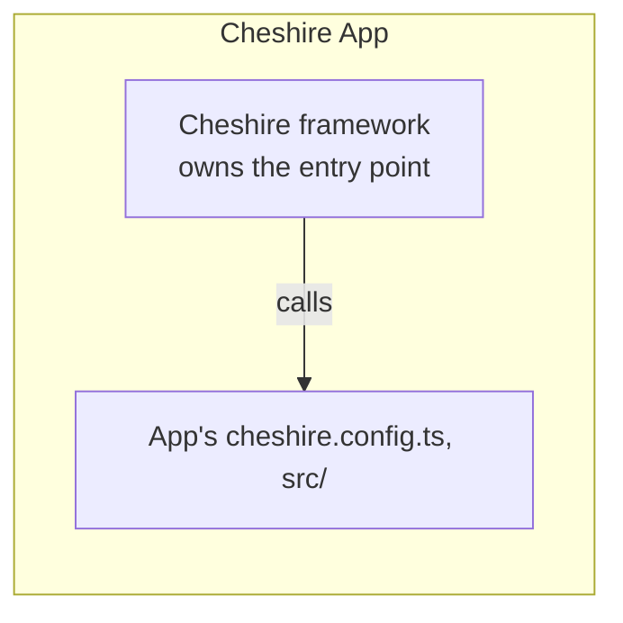
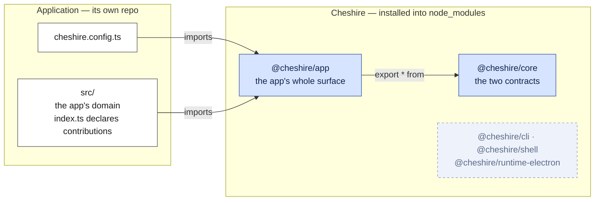
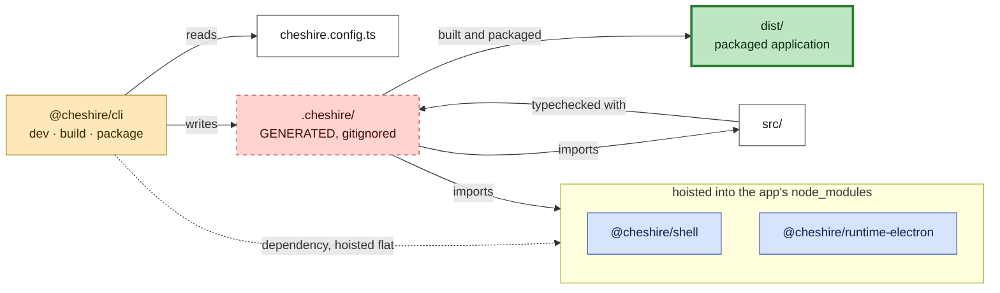
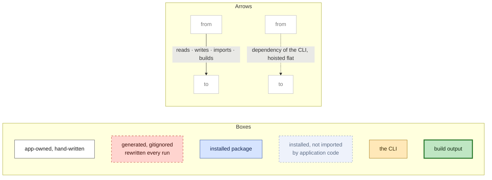
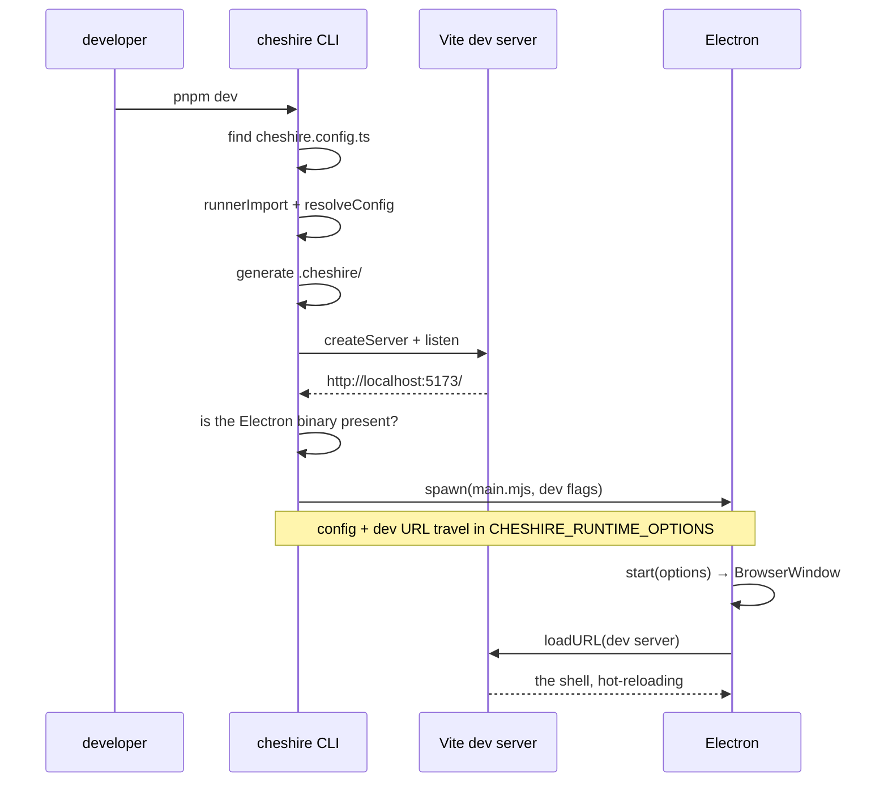
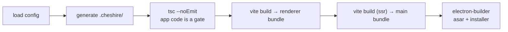

# Framework architecture

> **What this is.** The shape of Cheshire as a _framework_ — the problems any framework of this kind has to solve, the answer Cheshire picked for each, and why.
>
> **Who it is for.** An engineer comfortable with TypeScript and React who has _used_ Next.js or Vite but never opened one. No Electron background assumed.
>
> **What it is not.**
>
> - Not a decision record; [the principles](../principles.md) hold those, and where this document explains a decision it points at them rather than restating them.
> - Not a roadmap either; [design & roadmap](../design-and-roadmap.md) owns the structure, the package list and the stage plan, and this document assumes it.
> - Not the surface: what an application eventually contributes, and which system it contributes to, is [the application surface](../application-surface.md).
>
> **Reading order.** [principles](../principles.md) → [design & roadmap](../design-and-roadmap.md)
> → [the application surface](../application-surface.md) → this → [the tour](codebase-tour.md).
>
> **Status.** Written at the close of stage 0; refreshed at the close of stage 1, on 2026-08-05 for the systems vocabulary, and on 2026-08-19 after the package split. Everything described here exists and runs; where a thing is deliberately not built yet, it says so.

---

## 1. Overview

As a **framework**, Cheshire's design is based on IoC (Inversion of Control) principle.

> It owns the program and calls _you_. You supply the pieces it asks for, in the places it looks, and it decides when they run.



> **Why a framework and not a starter template.**  
> A template — "copy this repo and go" — hands over the same files without the inversion. Once an app owns the entry, every copy drifts on its own and one fix has to be applied once per app. The inversion is what makes a fix land everywhere at once. It is also why the generated entry is **rewritten on every run** rather than scaffolded once.

**How the inversion is implemented.** The framework owns the entry and calls the application through **data** it reads: the application default-exports a declaration, and Cheshire finds it, validates it and renders it. §3.4 covers that mechanism, §6 places it among the classic inversion-of-control patterns.

---

## 2. Framework — Application boundary

What belongs to the application, and what belongs to Cheshire.

|               | The application owns                   | Cheshire owns                                                   |
| ------------- | -------------------------------------- | --------------------------------------------------------------- |
| Configuration | `cheshire.config.ts`                   | every tsconfig, the Vite configs, the packaging config          |
| Contributions | `src/index.ts` — what the app declares | the contract it declares against, and the shell that renders it |
| Entry points  | _none — they are generated for it_     | the HTML entry, the renderer entry, the Electron main entry     |
| UI            | its own views and components           | the shell that hosts them                                       |
| Generated     | _nothing — it is written for them_     | `.cheshire/`                                                    |
| Build output  | its own renderer bundle                | its own packages, shipped built                                 |

Cheshire's capabilities arrive as **systems**, each reached through named _services_ — design, command, shell, settings, storage, identity, devtools ([design & roadmap](../design-and-roadmap.md) §3 owns the list).

The table above is the stage-1 slice. Today only views cross the boundary; commands and menus join them at stage 2. The whole list, and which system each contribution belongs to, is [the application surface](../application-surface.md).

### Two properties to preserve

#### 1. Cheshire arrives built

An application installs compiled JavaScript, type declarations and a stylesheet — no framework TypeScript source at all. An app's build therefore compiles app code only, just as the case with every other dependency ([principle 5](../principles.md)).

> **The consequence:** The framework needs **rebuild and republish** (`pnpm registry:publish`) after every edit/commit, followed by **refresh** at the consumer end with `pnpm update --latest "@cheshire/*"`

#### 2. Generated files live in the application, not the framework

`.cheshire/` sits in the app's own directory and is gitignored — the same convention as `.next/`, `.nuxt/` and `.svelte-kit/`.

### The boundary

The boundary shows up in two places, so it takes two diagrams sharing one key: what an application imports, and what the CLI does with those files on every run.

**A — the seam.** What an application imports, and what it never touches.



An application imports `@cheshire/app` and no other name. The faded box holds packages that are installed but never imported by application code, so no arrow reaches it.

**B — the pipeline.** What the CLI does with those files on every run.



> `.cheshire/` holds `index.html`, `renderer.tsx`, `config.ts`, `main.mjs`, `prod/main.mjs`, `tsconfig.json` and `env.d.ts`. Every file is rewritten on each run.

**Key**, shared by both.



---

## 3. Five problems, and how Cheshire solves them

Every framework in this family answers the same five questions. The answers are where they differ.

### 3.1 Finding the application

**The problem.** The CLI is a binary in `node_modules`. It has to work out which directory is
the application and where its code lives.

**Cheshire's answer: the config file is the marker.** `cheshire dev` looks for `cheshire.config.ts` in the
current directory. Present means this is an application; absent means the developer is in the
wrong place, and the error says so and names the fix.

This is the same convention as `next.config.js` or `vite.config.ts`, with one difference: for
Cheshire the file is not optional. It carries the app's identity — `appId`, `productName` — which a
desktop application cannot be built without.

### 3.2 Reading a config written in the application's language

**The problem.** `cheshire.config.ts` is TypeScript. Node does not run TypeScript, and the CLI needs
the value inside it before any bundler has started.

**Cheshire's answer: Vite's module runner loads it, once.** `runnerImport` compiles and evaluates
the file in-process, and the CLI then applies defaults with `resolveConfig`. The result is a
plain object that travels onward — into a generated module for the renderer, and into the
Electron process as either an environment variable (development) or a value baked into the
bundle (packaged).

The config is resolved **exactly once**, by the only process with a TypeScript-capable loader. Neither the renderer nor the Electron main process ever reads a config file or parses TypeScript.

### 3.3 Joining the framework and the application into one program

**The problem.** The framework has a shell, and the application has a config and some code. Some
file has to import both and start something. Whoever owns that file owns the boot sequence.

**Cheshire's answer: generated files in the application's directory.** On every run, `cheshire` writes
`.cheshire/` into the app: the HTML entry, the renderer entry that mounts the shell, the config
as a module, the Electron entries, a tsconfig and an ambient CSS declaration. Every file is
banner-marked as generated, and edits are lost on the next run.

The alternative — keeping the entry inside the framework package and reaching the app through
virtual module specifiers — was rejected. It forces the framework to ship its source, and the app
ends up holding both source and built output with nothing deciding which its imports resolve to.
Writing a few files into the app is the cheaper half of that trade. Because the importer lives in the app's directory, `@cheshire/shell`,
`@cheshire/runtime-electron` and `react` resolve by name from the app's own `node_modules`.
Nothing has to be aliased into existence.

Only `react` is the application's own declaration. `@cheshire/shell` and
`@cheshire/runtime-electron` are dependencies of **`@cheshire/cli`**, so pnpm installs them
transitively and hoists them flat into the app's `node_modules`. `.cheshire/` sits at the app
root, so Node's upward walk for a bare specifier reaches them on its first step.

The CLI never imports either package. It writes the files that do, which is what makes declaring
them its job: an application declares `@cheshire/app` and `@cheshire/cli` and nothing else of
Cheshire's, and never names a package it does not import.

**That "hoisted flat" is `nodeLinker: hoisted` in the generated `pnpm-workspace.yaml`, and this is
its second load-bearing reason.** The first is packaging: pnpm's default isolated linker uses
Windows junctions that electron-builder does not follow when collecting binaries. The second is
this one — under the isolated linker, `@cheshire/cli`'s dependencies sit behind `.pnpm/` and are
reachable only through `@cheshire/cli/node_modules`, where a file in `.cheshire/` cannot see them.

**Measured against two installs of the same generated application, one line apart:**

|                           | `hoisted`                                               | `isolated`                                           |
| ------------------------- | ------------------------------------------------------- | ---------------------------------------------------- |
| `node_modules/@cheshire/` | `app cli core runtime-electron shell`, real directories | `app cli` only, symlinks into `.pnpm/`               |
| `node_modules/.pnpm/`     | absent                                                  | present                                              |
| `pnpm install`            | succeeds                                                | **succeeds** — nothing in the manifest names shell   |
| `pnpm build`              | succeeds                                                | `error TS2307: Cannot find module '@cheshire/shell'` |

Both installs succeed. The manifest is satisfiable either way, so nothing at install time
indicates a problem.

The two failure modes differ. The packaging one fails late, at packaging, on Windows only. Resolution fails on the first build, on every platform — and the error
names a package the application never declared, with nothing to suggest a linker is involved.

Three details in the generated tsconfig are load-bearing, and each was paid for once:

- **`types: []`.** Naming `vite/client` fails with TS2688, because Vite is the framework's
  dependency and is not resolvable from the application. The generated ambient `declare module
'*.css'` replaces the one thing the app needed from it.
- **Every root listed explicitly.** TypeScript's wildcards skip dot-directories, so a file inside
  `.cheshire/` that a wildcard would have to find is checked by nothing at all — silently.
- **`build` typechecks and `dev` does not.** A dev server that refuses to reload because a type
  is momentarily wrong is a worse tool.

### 3.4 Discovering what the application declared

**The problem.** An app contributes views, commands and menus. Something has to find them and
register them.

**Cheshire's answer: one default export, imported by the generated renderer.** `src/index.ts`
default-exports `defineApp({ views })`, and the renderer the framework writes imports it by
relative path. There is no registry to call, no lifecycle hook to implement, and no scanning of
the filesystem for files that look like views — the app hands over a value, and the shell
renders it.

```ts
// src/index.ts, in the application
import { defineApp } from "@cheshire/app";
import { Welcome } from "./views/Welcome";

export default defineApp({
	views: [{ id: "welcome", title: "Welcome", component: Welcome }],
});
```

Breaking that shape into its parts:

```ts
export default defineApp({      ← root: the declaration
  views: [                      ← branch: a contribution kind
    { id, title, component }    ← node: one contribution
  ]                                 ↑
})                                  leaf: app code; the component here
```

Everything above the leaf is inert data the framework reads. The leaf is the application's own
executable code, which the framework decides when to run — a view's component today, a command's
handler at stage 2.

Three properties of that shape:

- **Declarative, not imperative.** The app says what exists; it never says what is on screen.
  Which view is active is the shell's state, so layout persistence (stage 3) has somewhere to
  live that the app cannot contradict.
- **`defineApp` is identity at run time.** Like `defineConfig`, it exists so the developer gets
  completion and a type error at the line they wrote, rather than a stack from a generated file.
  What survives it is validated again by `resolveApp`, whose messages name `src/index.ts`.
- **A view is a React component and nothing else.** No base class, no lifecycle, nothing imported
  from the runtime. That keeps [principle 4](../principles.md) intact: React is the platform's UI
  language under Electron and would be under Tauri too, so naming it is not naming the runtime.

The contract lives in `@cheshire/core` on a **separate entry**, `@cheshire/core/views`, forwarded
whole by `@cheshire/app` so an application still names one package. The split is load-bearing:
`@cheshire/runtime-electron` imports the core barrel from the main process, and the barrel must stay
React-free — with `skipLibCheck` on, an unresolved `react` inside a `.d.ts` degrades to `any` in
silence rather than erroring.

A second split runs across it, by audience. `@cheshire/core/views` carries `defineApp` and
its types — what an application declares. `resolveApp` and `CheshireAppError`, which validate a
declaration, sit on `@cheshire/core/views/internal` and are `@cheshire/shell`'s alone. `@cheshire/app` can therefore be `export *` rather than a hand-kept list: a public entry is exactly
the application-facing API, so forwarding all of it cannot leak an internal, and a symbol added
upstream cannot go silently missing downstream.

Commands and menus (stage 2) extend the same object. Nothing about the mechanism changes.

### 3.5 Staying correct while you edit

**The problem.** Two processes, two build outputs, and a developer editing code in the middle of
it.

**Cheshire's answer:**

- The **renderer** is served by Vite, with hot module replacement. Editing a view updates the
  window without a restart — app code is inside the dev module graph, reached through the
  generated renderer's import of `../src/index`.
- The **main process** is not watched. It is entirely framework code, and framework code is fixed
  for the duration of a dev session — restart the app to pick up a new one.
- **Types** are checked on `build`, not on `dev` (§3.3).

---

## 4. The pipeline, end to end



`build` and `package` share the first three steps and diverge after:



The last two steps decide how packaging works.

**The main process is bundled, with the runtime inlined.** `electron` and the Node builtins stay
external — they are baked into the Electron binary and exist only at run time, so they cannot be
bundled and do not need to be. Everything else is concatenated into one file.

**Therefore a packaged application ships no `node_modules` at all.** The asar contains the main
bundle, the renderer bundle and a `package.json`, and nothing else. The application names no runtime anywhere in it, which is [principle 4](../principles.md) in practice.

electron-builder collects production dependencies in a pass of its own,
_outside_ the `files` patterns, and only an explicit `!node_modules/**` stops it. That negation used to have a backstop: every `@cheshire/*` was a devDependency, so the production pass found nothing to collect. Since
`@cheshire/app` became the application's import surface it is a real **dependency**, beside
`react` and `react-dom`, and the pass has entries to walk. Remove the negation and the installer
grows to match.

---

## 5. What Electron adds that a web framework does not

Next.js has one runtime target: a browser, plus a server you do not ship. A desktop framework has
two processes in one shipped artifact, and a native binary underneath.

**Two processes, one program.** The **main** process is Node with the desktop APIs — windows,
menus, dialogs, the filesystem. The **renderer** is a browser page. Cheshire owns both. An app's code
runs only in the renderer, and never names the runtime: no Electron modules, no IPC channels, no
process or window APIs ([principle 4](../principles.md)). The runtime _interfaces_ that will make
that portable are designed with the runtime layer, not deferred until a second runtime exists;
a port is what validates them, and is expected to expose gaps when it happens.

**The renderer is treated as web content.** `contextIsolation: true`,
`nodeIntegration: false`, `sandbox: true`, in development and in production alike. App code never reaches those APIs, so none of these settings costs the application anything. Links the app does not own open in
the user's browser, not in a chrome-less Electron window.

**The binary is not installed for you.** Electron 43 declares no postinstall — it ships its
downloader as a bin and expects someone to call it. Nobody does, so `cheshire dev` checks for the
binary and fetches it. Without that, a generated app's very first `pnpm dev` dies on a cryptic
missing-path error from inside `electron/index.js`.

**Development needs flags production must never have.** On Linux, an unpackaged launch passes
`--no-sandbox`: Ubuntu 22+ AppArmor blocks Electron's unprivileged-userns helper, and nothing
SUIDs `chrome-sandbox` inside `node_modules`, so the sandbox helper cannot start at all. A real
installation is unaffected, because the installer's postinstall does SUID it.

> This is **not** `webPreferences.sandbox`, which stays `true` everywhere. They are different
> settings with confusingly similar names, and the flag is dev-only and Linux-only. The reasoning
> lives at the call site in `packages/cli/src/electron.ts` — keep it there.

---

## 6. Where Cheshire is deliberately different

**A real install is the only proof.** Workspace links resolve source paths and hide packaging
failures — an `exports` entry pointing at a `.ts` file works perfectly through a link and fails
on every real install. So Cheshire's playground and every gate consume the framework from a **local
registry**, from the very first run. During stage 0 the rule caught a package that installed with no type declarations at all, because one build step emptied the directory another had written to.

**No plugin system.** Views, commands and menus contributed by an application are the platform's
ordinary surface, not a plugin mechanism. The application is the only extension. That removes an entire category of machinery — manifests parsed at runtime, per-extension sandboxes, trust classes, an API version handshake between host and extension, lazy activation events — and makes **a contribution a value the compiler can see**. A typo'd command id in a menu becomes a build
error naming the application's own file, not a warning in a log at runtime.

**The classic inversion-of-control patterns apply unevenly, and the gaps are the informative part.**

| Pattern                  | Where it appears in Cheshire                                                                                                                                                                                                                                                                          |
| ------------------------ | ----------------------------------------------------------------------------------------------------------------------------------------------------------------------------------------------------------------------------------------------------------------------------------------------------- |
| **Template method**      | Structurally the closest. Cheshire fixes the skeleton — boot sequence, mount, the shell's zones — and the application fills named slots. The slots are filled by values in an object literal, not by overriding methods on a base class; there is no inheritance anywhere in the surface.             |
| **Strategy**             | At the leaves. `component` is a React component Cheshire decides when to render; a command handler (stage 2) will be the same shape. Accurate about a single contribution, silent about the fact that the whole application arrives as one declared tree.                                             |
| **Dependency injection** | Framework-internal, at seams, with no container. `mountShell({ config, app })` is the shell's injection point; host-side services are handed to the host entry as a context object. On the renderer side each service has one typed zero-argument hook — React context, resolved by the type checker. |
| **Service locator**      | Deliberately absent. There is no `container.get("commands")`. A locator exists to resolve late-bound, independently versioned, untrusted code at run time; [principle 3](../principles.md) removes all three, so the bundler's import graph _is_ the resolution.                                      |

The last row is the same collapse the previous item describes for plugin machinery, seen from the dependency side: strip late binding and the runtime lookup goes with it.

**Capabilities are grouped into systems.** Everything Cheshire ships belongs to a system an application declares into, and every system is reached through named **services** — one typed hook each.
The test of whether something belongs in a system is whether an application would otherwise
write it: a shortcut matcher, a menu bar, a theme switcher, a docking implementation. None of
those are application code, in any phase. The canonical list is
[design & roadmap](../design-and-roadmap.md) §3.

---

## 7. Vocabulary

| Term                          | Meaning                                                                                                                                                                                                                    |
| ----------------------------- | -------------------------------------------------------------------------------------------------------------------------------------------------------------------------------------------------------------------------- |
| **application** / **app**     | What a developer builds with Cheshire. Cheshire's customer.                                                                                                                                                                |
| **the framework**             | This repository: packages, templates, CLIs.                                                                                                                                                                                |
| **system**                    | A capability Cheshire ships whole, that an application declares into and never implements — design, command, shell, settings, storage, identity, devtools ([design & roadmap](../design-and-roadmap.md) §3 owns the list). |
| **the design system**         | Components, icons, and the design-token contract. `@cheshire/ui`. Not built.                                                                                                                                               |
| **the shell**                 | The root of the renderer: title bar, **body**, status bar, and an overlay plane. `@cheshire/shell`.                                                                                                                        |
| **the body**                  | The shell's middle zone, holding the regions. Named so it cannot be confused with _activity bar_.                                                                                                                          |
| **the command system**        | Commands, shortcuts, menus, context menus, the palette. A menu item is a _command reference_ — it never holds a handler. Not built.                                                                                        |
| **the config contract**       | `cheshire.config.ts` — what the application _is_.                                                                                                                                                                          |
| **the contribution contract** | `src/index.ts` — what the application _contributes_.                                                                                                                                                                       |
| **template**                  | An opinionated blueprint: a configuration of Cheshire's systems, materialised by `create-cheshire`. `workbench` is the only one built.                                                                                     |
| **view**                      | An id, a title, and a React component. What the shell renders.                                                                                                                                                             |
| **derivatives**               | The generated contents of `.cheshire/`. Rewritten every run, never edited.                                                                                                                                                 |
| **the seam**                  | The published surface: what an app can import and nothing more.                                                                                                                                                            |
| **main process**              | Electron's Node process. Owns windows and the desktop. Framework-only.                                                                                                                                                     |
| **renderer**                  | The browser page. Where app UI runs.                                                                                                                                                                                       |
| **asar**                      | Electron's archive format for an app's files inside a package.                                                                                                                                                             |
| **the proof gate**            | publish to the local registry → generate an app → build → run it, on real artifacts.                                                                                                                                       |
| **workbench**                 | The name of a _template_ — the VS Code-like blueprint. Not the package that draws it; that is `@cheshire/shell`.                                                                                                           |

---

## 8. What this document does not cover

- **The roadmap, package factoring, and what a template is** —
  [design & roadmap](../design-and-roadmap.md).
- **What is true at all times** — [principles](../principles.md).
- **What the code says** — [the codebase tour](codebase-tour.md).
- **The full contribution surface and the systems behind it** — every contribution kind, the host
  process, and which zone each service sits in —
  [the application surface](../application-surface.md). That document settles the _layering_; it
  deliberately does not settle the API shape of anything unbuilt, which is the building stage's
  call.
- **Commands, menus and layout persistence as code** — stages 2 and 3. Designed in the surface
  document, not built here yet.
