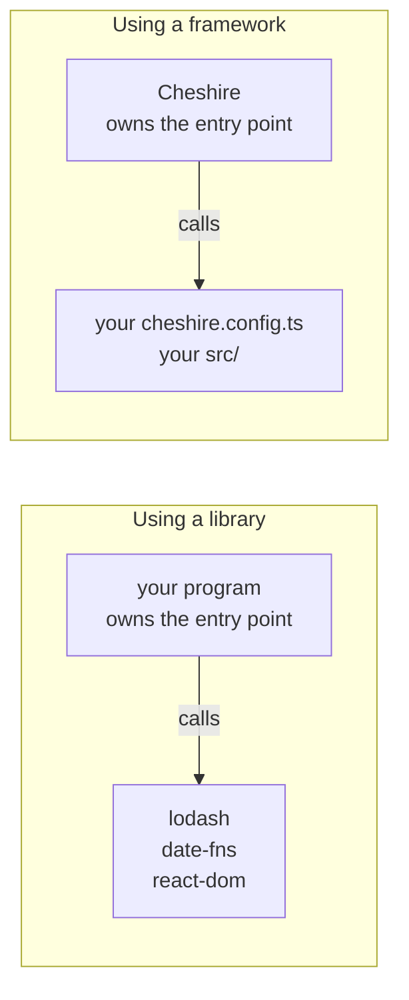
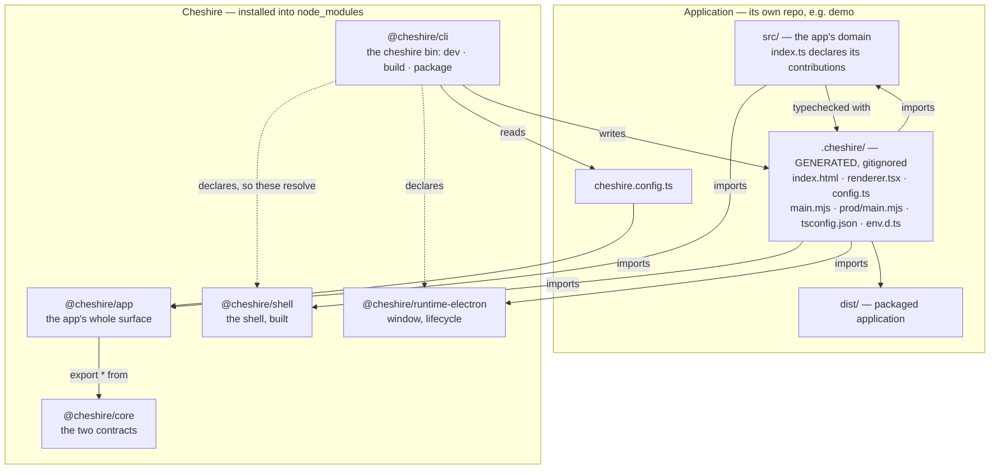
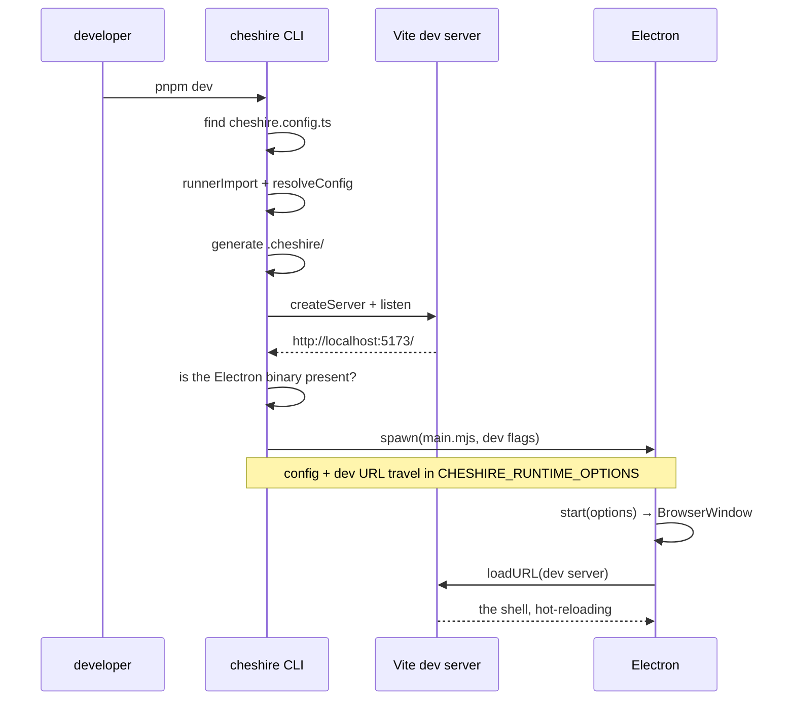
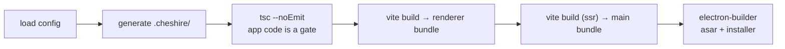

# Framework architecture

> **What this is.** The shape of Cheshire as a _framework_ — the handful of problems any framework
> of this kind has to solve, the answer Cheshire picked for each, and why. It is the conceptual
> layer under [the codebase tour](codebase-tour.md): the tour walks the code, this explains the
> pattern the code is an instance of.
>
> **Who it is for.** An engineer comfortable with TypeScript and React who has _used_ Next.js or
> Vite but never opened one. No Electron background assumed.
>
> **What it is not.** Not a decision record — [the principles](../principles.md) hold those, and
> where this document explains a decision it points at them rather than restating them. Not a
> roadmap either; [design & roadmap](../design-and-roadmap.md) owns the structure, the package
> list and the stage plan, and this document assumes it. Not the surface either: what an
> application eventually contributes, and which system it contributes to, is
> [the application surface](../application-surface.md).
>
> **Reading order.** [principles](../principles.md) → [design & roadmap](../design-and-roadmap.md)
> → [the application surface](../application-surface.md) → this → [the tour](codebase-tour.md).
>
> **Status.** Written at the close of stage 0, refreshed at the close of stage 1, and again on
> 2026-08-05 for the systems vocabulary. Everything described here exists and runs; where a thing
> is deliberately not built yet, it says so.

---

## 1. Library versus framework: who calls whom

A **library** is code you call. You own the program, you reach for the library when you need it,
and it has no opinion about the rest of your application.

A **framework** inverts that. It owns the program and calls _you_. You supply the pieces it asks
for, in the places it looks, and it decides when they run.



This is **inversion of control** — _don't call us, we'll call you_. React is a mild example: you
write components, React decides when to render them. Next.js is a strong one, and Cheshire is the
same strength. An application never writes the HTML entry, never writes the module that mounts
the shell, never writes the Electron main process, and never configures the bundler.

**What it costs:** freedom at the edges. You cannot restructure the boot sequence, swap the
bundler, or add a build step, because you do not own the files those live in.

**What it buys:** everything at the edges is already correct, uniformly, for every application —
including the parts nobody wants to re-derive per app: the renderer's sandbox settings, how the
window is created, how the app is packaged, which flags a development launch needs on Linux.

> **Why a framework and not a starter template.** A template — "copy this repo and go" — hands
> over the same files without the inversion. The moment an app owns the entry, every app's copy
> drifts on its own, and one fix has to be applied N times by N people who each have to be told.
> The inversion is what makes a fix land everywhere at once. It is also why the generated entry
> is **rewritten on every run** rather than scaffolded once: a file you regenerate is a file the
> framework still owns.

---

## 2. The ownership line

Everything below is downstream of one boundary: which files belong to the application, and which
belong to Cheshire.

|  | The application owns | Cheshire owns |
| --- | --- | --- |
| Configuration | `cheshire.config.ts` | every tsconfig, the Vite configs, the packaging config |
| Contributions | `src/index.ts` — what the app declares | the contract it declares against, and the shell that renders it |
| Entry points | _none — they are generated for it_ | the HTML entry, the renderer entry, the Electron main entry |
| UI | its own views and components | the shell that hosts them |
| Generated | _nothing — it is written for them_ | `.cheshire/` |
| Build output | its own renderer bundle | its own packages, shipped built |

That line generalises past files. Cheshire's capabilities arrive as **systems**, each reached through named
services — design, command, shell, settings, storage, identity, devtools — and the
application's job at every one is to *declare into* it, never to implement it. The table above is the stage-1 slice of
that: today only views cross the line, and by stage 2 commands and menus do. The whole list, and
which system each contribution belongs to, is [the application surface](../application-surface.md).

Two properties are worth naming, because they are the ones that decay quietly if nobody watches.

**Cheshire arrives built.** What an application installs is compiled JavaScript, type declarations
and a stylesheet — no framework TypeScript source at all. An app's build therefore compiles app
code only, the same relationship it has with every other dependency
([principle 5](../principles.md)). The consequence for you, on day one: after editing framework
source you must **rebuild and republish** (`pnpm registry:publish`), then refresh the consumer
with `pnpm update --latest "@cheshire/*"` — or your change silently does not appear, with nothing
said about why.

**Generated files live in the application, not the framework.** `.cheshire/` sits in the app's own
directory and is gitignored — the same convention as `.next/`, `.nuxt/` and `.svelte-kit/`.



---

## 3. Five problems, and how Cheshire solves them

Every framework in this family answers the same five questions. The answers are what make one
framework feel different from another.

### 3.1 Finding the application

**The problem.** The CLI is a binary in `node_modules`. It has to work out which directory is
the application and where its code lives.

**Cheshire's answer: the config file is the marker.** `cheshire dev` looks for `cheshire.config.ts` in the
current directory. Present means this is an application; absent means the developer is in the
wrong place, and the error says so and names the fix.

This is the same convention as `next.config.js` or `vite.config.ts`, with one difference: for
Cheshire the file is not optional. It carries the app's identity — `appId`, `productName` — which a
desktop application cannot be built without.

### 3.2 Reading a config written in the application's language

**The problem.** `cheshire.config.ts` is TypeScript. Node does not run TypeScript, and the CLI needs
the value inside it before any bundler has started.

**Cheshire's answer: Vite's module runner loads it, once.** `runnerImport` compiles and evaluates
the file in-process, and the CLI then applies defaults with `resolveConfig`. The result is a
plain object that travels onward — into a generated module for the renderer, and into the
Electron process as either an environment variable (development) or a value baked into the
bundle (packaged).

The property that matters: **the config is resolved exactly once, by the only process that has a
TypeScript-capable loader.** Neither the renderer nor the Electron main process ever reads a
config file or parses TypeScript.

### 3.3 Joining the framework and the application into one program

**The problem.** The framework has a shell, and the application has a config and some code. Some
file has to import both and start something. Whoever owns that file owns the boot sequence.

**Cheshire's answer: generated files in the application's directory.** On every run, `cheshire` writes
`.cheshire/` into the app: the HTML entry, the renderer entry that mounts the shell, the config
as a module, the Electron entries, a tsconfig and an ambient CSS declaration. Every file is
banner-marked as generated, and edits are lost on the next run.

The alternative — keeping the entry inside the framework package and reaching the app through
virtual module specifiers — was rejected. It forces the framework to ship its source, and the app
ends up holding both source and built output with nothing deciding which its imports resolve to.
Writing a few files into the app is the cheaper half of that trade, and it buys one thing
outright: because the importer physically lives in the app's directory, `@cheshire/shell`,
`@cheshire/runtime-electron` and `react` resolve by name from the app's own `node_modules`.
Nothing has to be aliased into existence.

Only `react` is the application's own declaration. The two framework packages are dependencies of
**`@cheshire/cli`**, hoisted flat into the app's `node_modules` — which is the honest arrangement,
because the CLI is what emits those import statements and so is what must guarantee they resolve.
An application declares `@cheshire/app` and `@cheshire/cli` and nothing else of Cheshire's; it
never names a package it does not import.

**That "hoisted flat" is `nodeLinker: hoisted` in the generated `pnpm-workspace.yaml`, and this is
its second load-bearing reason.** The first is packaging: pnpm's default isolated linker uses
Windows junctions that electron-builder does not follow when collecting binaries. The second is
this one — under the isolated linker, `@cheshire/cli`'s dependencies sit behind `.pnpm/` and are
reachable only through `@cheshire/cli/node_modules`, where a file in `.cheshire/` cannot see them.

**Measured against two installs of the same generated application, one line apart:**

| | `hoisted` | `isolated` |
| --- | --- | --- |
| `node_modules/@cheshire/` | `app cli core runtime-electron shell`, real directories | `app cli` only, symlinks into `.pnpm/` |
| `node_modules/.pnpm/` | absent | present |
| `pnpm install` | succeeds | **succeeds** — nothing in the manifest names shell |
| `pnpm build` | 396.67 kB renderer | `error TS2307: Cannot find module '@cheshire/shell'` |

The install succeeding on both sides is the part worth noticing: the manifest is satisfiable
either way, so nothing at install time indicates a problem.

The failure modes are asymmetric, and the packaging one is the quieter half: it fails late, at
packaging, on Windows only. Resolution fails on the first build, on every platform — and the error
names a package the application never declared, with nothing to suggest a linker is involved.

Three details in the generated tsconfig are load-bearing, and each was paid for once:

- **`types: []`.** Naming `vite/client` fails with TS2688, because Vite is the framework's
  dependency and is not resolvable from the application. The generated ambient `declare module
  '*.css'` replaces the one thing the app needed from it.
- **Every root listed explicitly.** TypeScript's wildcards skip dot-directories, so a file inside
  `.cheshire/` that a wildcard would have to find is checked by nothing at all — silently.
- **`build` typechecks and `dev` does not.** A dev server that refuses to reload because a type
  is momentarily wrong is a worse tool.

### 3.4 Discovering what the application declared

**The problem.** An app contributes views, commands and menus. Something has to find them and
register them.

**Cheshire's answer: one default export, imported by the generated renderer.** `src/index.ts`
default-exports `defineApp({ views })`, and the renderer the framework writes imports it by
relative path. There is no registry to call, no lifecycle hook to implement, and no scanning of
the filesystem for files that look like views — the app hands over a value, and the shell
renders it.

```ts
// src/index.ts, in the application
import { defineApp } from '@cheshire/app'
import { Welcome } from './views/Welcome'

export default defineApp({
  views: [{ id: 'welcome', title: 'Welcome', component: Welcome }],
})
```

Three properties of that shape are the point of it:

- **Declarative, not imperative.** The app says what exists; it never says what is on screen.
  Which view is active is the shell's state, so layout persistence (stage 3) has somewhere to
  live that the app cannot contradict.
- **`defineApp` is identity at run time.** Like `defineConfig`, it exists so the developer gets
  completion and a type error at the line they wrote, rather than a stack from a generated file.
  What survives it is validated again by `resolveApp`, whose messages name `src/index.ts`.
- **A view is a React component and nothing else.** No base class, no lifecycle, nothing imported
  from the runtime. That keeps [principle 4](../principles.md) intact: React is the platform's UI
  language under Electron and would be under Tauri too, so naming it is not naming the runtime.

The contract lives in `@cheshire/core` on a **separate entry**, `@cheshire/core/views`, forwarded
whole by `@cheshire/app` so an application still names one package. The split is load-bearing:
`@cheshire/runtime-electron` imports the core barrel from the main process, and the barrel must stay
React-free — with `skipLibCheck` on, an unresolved `react` inside a `.d.ts` degrades to `any` in
silence rather than erroring.

Crossing that split is a second one, by audience. `@cheshire/core/views` carries `defineApp` and
its types — what an application declares. `resolveApp` and `CheshireAppError`, which validate a
declaration, sit on `@cheshire/core/views/internal` and are `@cheshire/shell`'s alone. That is
what lets `@cheshire/app` be `export *` rather than a hand-kept list: a public entry is exactly
the application-facing API, so forwarding all of it cannot leak an internal, and a symbol added
upstream cannot go silently missing downstream.

Commands and menus (stage 2) extend the same object. Nothing about the mechanism changes.

### 3.5 Staying correct while you edit

**The problem.** Two processes, two build outputs, and a developer editing code in the middle of
it.

**Cheshire's answer:**

- The **renderer** is served by Vite, with hot module replacement. Editing a view updates the
  window without a restart — app code is inside the dev module graph, reached through the
  generated renderer's import of `../src/index`.
- The **main process** is not watched. It is entirely framework code, and framework code is fixed
  for the duration of a dev session — restart the app to pick up a new one.
- **Types** are checked on `build`, not on `dev` (§3.3).

---

## 4. The pipeline, end to end



`build` and `package` share the first three steps and diverge after:



Two things about that last pair deserve emphasis, because they are the reason the packaging works
the way it does.

**The main process is bundled, with the runtime inlined.** `electron` and the Node builtins stay
external — they are baked into the Electron binary and exist only at run time, so they cannot be
bundled and do not need to be. Everything else is concatenated into one file.

**Therefore a packaged application ships no `node_modules` at all.** The asar contains the main
bundle, the renderer bundle and a `package.json`: about 396 KB for the stage-1 app. The
application names no runtime anywhere in that — [principle 4](../principles.md) holding in
practice rather than in principle.

The trap under it: electron-builder collects production dependencies in a pass of its own,
_outside_ the `files` patterns, and only an explicit `!node_modules/**` stops it. That negation
is now the whole defence rather than half of it. It used to be backed up by an accident — every
`@cheshire/*` was a devDependency, so the production pass found nothing to collect. Since
`@cheshire/app` became the application's import surface it is an honest **dependency**, beside
`react` and `react-dom`, and the pass has real entries to walk. Remove the negation and the
installer grows to match.

---

## 5. What Electron adds that a web framework does not

Next.js has one runtime target: a browser, plus a server you do not ship. A desktop framework has
two processes in one shipped artifact, and a native binary underneath.

**Two processes, one program.** The **main** process is Node with the desktop APIs — windows,
menus, dialogs, the filesystem. The **renderer** is a browser page. Cheshire owns both. An app's code
runs only in the renderer, and never names the runtime: no Electron modules, no IPC channels, no
process or window APIs ([principle 4](../principles.md)). The runtime *interfaces* that will make
that portable are designed with the runtime layer, not deferred until a second runtime exists;
a port is what validates them, and is expected to expose gaps when it happens.

**The renderer is treated as web content, because it is.** `contextIsolation: true`,
`nodeIntegration: false`, `sandbox: true`, in development and in production alike. Since app code
never reaches those APIs anyway, none of it is a compromise. Links the app does not own open in
the user's browser, not in a chrome-less Electron window.

**The binary is not installed for you.** Electron 43 declares no postinstall — it ships its
downloader as a bin and expects someone to call it. Nobody does, so `cheshire dev` checks for the
binary and fetches it. Without that, a generated app's very first `pnpm dev` dies on a cryptic
missing-path error from inside `electron/index.js`.

**Development needs flags production must never have.** On Linux, an unpackaged launch passes
`--no-sandbox`: Ubuntu 22+ AppArmor blocks Electron's unprivileged-userns helper, and nothing
SUIDs `chrome-sandbox` inside `node_modules`, so the sandbox helper cannot start at all. A real
installation is unaffected, because the installer's postinstall does SUID it.

> This is **not** `webPreferences.sandbox`, which stays `true` everywhere. They are different
> settings with confusingly similar names, and the flag is dev-only and Linux-only. The reasoning
> lives at the call site in `packages/cli/src/electron.ts` — keep it there.

---

## 6. Where Cheshire is deliberately different

**A real install is the only proof.** Workspace links resolve source paths and hide packaging
failures — an `exports` entry pointing at a `.ts` file works perfectly through a link and fails
on every real install. So Cheshire's playground and every gate consume the framework from a **local
registry**, from the very first run. This is not caution; it is the rule that caught, during stage
0, a package that installed with no type declarations at all because one build step emptied the
directory another had written to.

**No plugin system.** Views, commands and menus contributed by an application are the platform's
ordinary surface, not a plugin mechanism. The application is the only extension. What that removes
is an entire category of machinery — manifests parsed at runtime, per-extension sandboxes, trust
classes, an API version handshake between host and extension, lazy activation events — and what
it buys is that
**a contribution is a value the compiler can see**. A typo'd command id in a menu becomes a build
error naming the application's own file, not a warning in a log at runtime.

**Systems, not a pile of APIs.** Everything Cheshire ships is grouped as a system an application
declares into, and every system is reached through named **services** — one typed hook each.
The test of whether something belongs in a system is whether an application would otherwise
write it: a shortcut matcher, a menu bar, a theme switcher, a docking implementation. None of
those are application code, in any phase. The canonical list is
[design & roadmap](../design-and-roadmap.md) §3.

**Build with vision.** Scope and direction come from the product owner. There is no
evidence-gating and no "wait for a second consumer" argument here; the one thing that gets
escalated rather than decided quietly is a genuinely hard-to-reverse choice — a published API
name, a persisted format, a wire protocol.

**Momentum over meta-work.** Every stage ends with something that runs, and it is actually run.
Consolidation, documentation and refactoring queue _behind_ the next runnable milestone.

---

## 7. Vocabulary

| Term | Meaning |
| --- | --- |
| **application** / **app** | What a developer builds with Cheshire. Cheshire's customer. |
| **the framework** | This repository: packages, templates, CLIs. |
| **system** | A capability Cheshire ships whole, that an application declares into and never implements — design, command, workbench, settings, storage, diagnostics. |
| **the design system** | Components, icons, and the design-token contract. `@cheshire/ui`. Not built. |
| **the shell** | The root of the renderer: title bar, **body**, status bar, and an overlay plane. `@cheshire/shell`. |
| **the body** | The shell's middle zone, holding the regions. Named so it cannot be confused with *activity bar*. |
| **the command system** | Commands, shortcuts, menus, context menus, the palette. A menu item is a *command reference* — it never holds a handler. Not built. |
| **the config contract** | `cheshire.config.ts` — what the application *is*. |
| **the contribution contract** | `src/index.ts` — what the application *contributes*. |
| **template** | An opinionated blueprint: a configuration of Cheshire's systems, materialised by `create-cheshire`. `workbench` is the only one built. |
| **view** | An id, a title, and a React component. What the shell renders. |
| **derivatives** | The generated contents of `.cheshire/`. Rewritten every run, never edited. |
| **the seam** | The published surface: what an app can import and nothing more. |
| **main process** | Electron's Node process. Owns windows and the desktop. Framework-only. |
| **renderer** | The browser page. Where app UI runs. |
| **asar** | Electron's archive format for an app's files inside a package. |
| **the proof gate** | publish to the local registry → generate an app → build → run it, on real artifacts. |
| **workbench** | The name of a *template* — the VS Code-like blueprint. Not the package that draws it; that is `@cheshire/shell`. |

---

## 8. What this document does not cover

- **The roadmap, package factoring, and what a template is** —
  [design & roadmap](../design-and-roadmap.md).
- **What is true at all times** — [principles](../principles.md).
- **What the code actually says** — [the codebase tour](codebase-tour.md).
- **The full contribution surface and the systems behind it** — every contribution kind, the host
  process, and which zone each service sits in —
  [the application surface](../application-surface.md). That document settles the *layering*; it
  deliberately does not settle the API shape of anything unbuilt, which is the building stage's
  call.
- **Commands, menus and layout persistence as code** — stages 2 and 3. Designed in the surface
  document, not built here yet.
